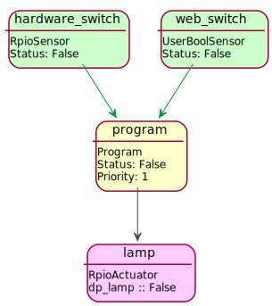

============
Introduction
============

What is Automate?
-----------------

Automate is a general purpose automatization library for Python.
Its objective is to offer convenient and robust object-oriented programming
framework for complex state machine systems. Automate can be used to design
complex automation systems, yet it is easy to learn and fun to use. It was
originally developed with home robotics/automatization projects in mind,
but is quite general in nature and one could find applications from various
fields that could take advantage of Automate. Automate can be embedded
in other Python software as a component, which runs its operations in
its own threads.

Highlights
----------

* Supported hardware:

  * Raspberry Pi GPIO input/output ports (:ref:`automate-rpio` via `RPIO <http://pythonhosted.org/RPIO/>`_ library)
  * Arduino analog and digital input/output ports (:ref:`automate-arduino` via `pyFirmata <https://github.com/tino/pyFirmata>`_ library)
  * Easy to write extensions to support other hardware, see :ref:`extensions`

* :ref:`state-saving`
* Intelligent design:

  * Comprehensively tested via ``py.test`` unit/integration tests
  * Takes advantage of `Traits <http://traits.readthedocs.org/en/4.5.0/>`_ library, especially its
    notification system.
  * `IPython <http://ipython.org>`_ console to monitor, modify and control system on-the-fly
  * Versatile function/callable library to write state program logic

* RPC and Websocket interfaces (provided by :ref:`automate-rpc` and :ref:`automate-webui`) to connect
  between other applications or other Automate systems.
* Comprehensive and customizable Web User Interface via :ref:`automate-webui`
* UML graphs can be drawn automaticlaly of the system (as can be seen in the examples of this documentation)

.. _hello-world:

"Hello World" in Automate
-------------------------
Let us consider following short Automate program as a first example:

.. literalinclude:: hello_world.py

This simple example has two sensors ``hardware_switch``, ``web_switch``, actuator (``lamp``) and a ``program`` that
contains logic what to do and when. Here, ``lamp`` is switched on if either ``web_switch`` or ``hardware_switch`` has
status True. :class:`~automate_webui.webui.WebService` with default settings is enabled so that user can
monitor system and set
status of ``web_switch``. The following figure (generated via :class:`~automate_webui.webui.WebService` interface)
illustrates the system in UML graph:

Original application
--------------------

Automate was originally developed in order to enable simple and robust way of programming
home automatization with `Raspberry Pi <http://www.raspberrypi.org>`_ minicomputer, to obtain
automatization and automatic monitoring of rather complex planted aquarium safety/controlling
system.
