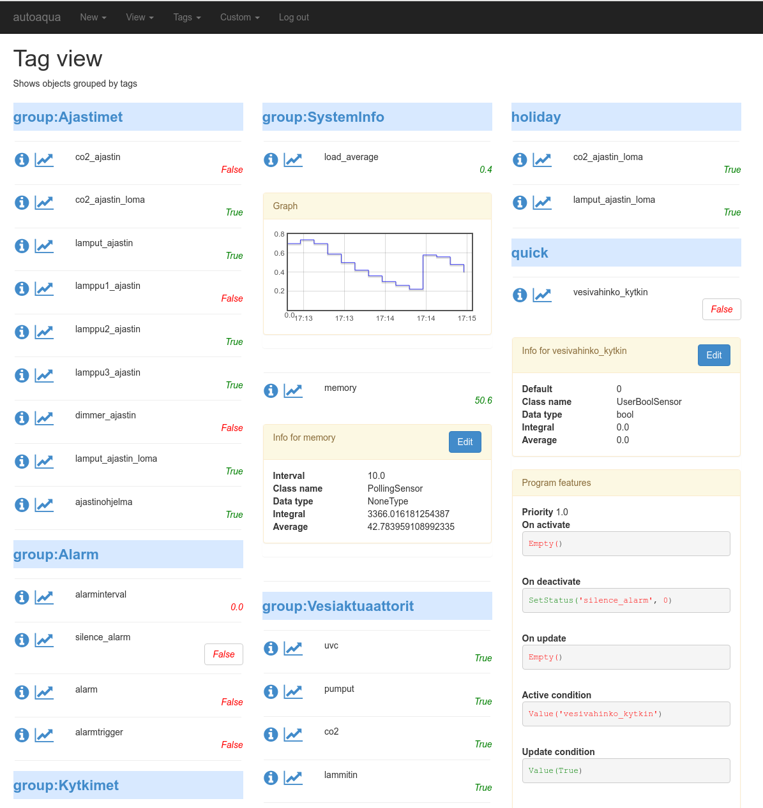
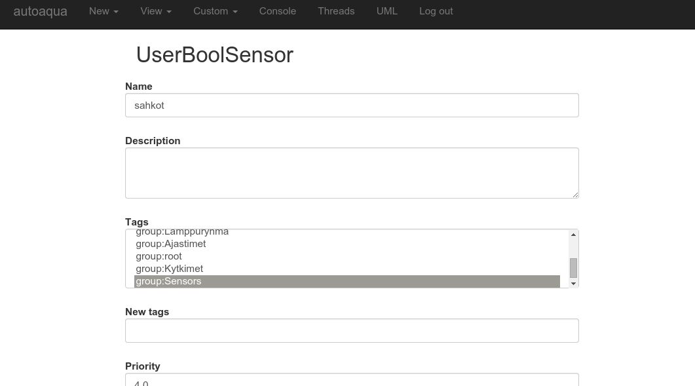
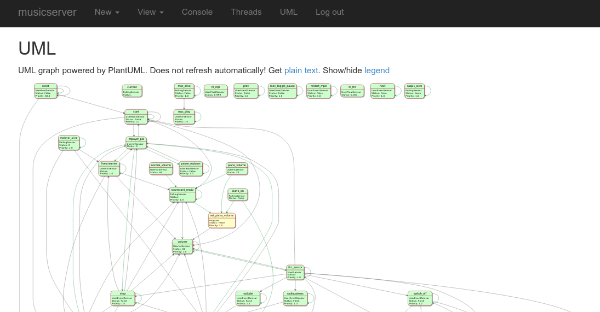
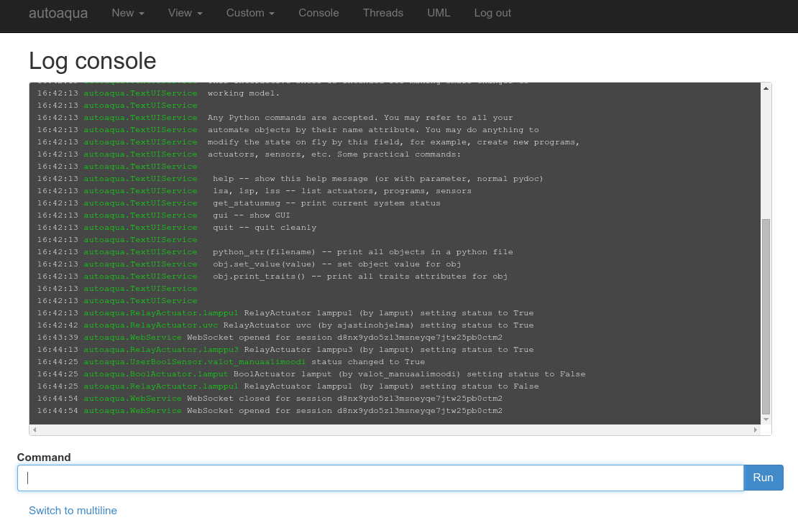

.. _automate-webui:

Web User Interface for Automate
===============================

Github URL: http://github.com/tuomas2/automate-webui

Introduction
------------

Automate Web UI extension provides easy to use approach to monitoring and modifying
Automate system and its components. Features:

 - Displayed data updated in real time via Websocket
 - Responsive design (using `Bootstrap <http://getbootstrap.com/>`_ CSS & JS library), suitable for
   mobile and desktop use.
 - Optional authentication
 - Read-only and read-write modes.

    - Read-only mode allows only monitoring (default)
    - Read-write mode allows modifying the System by:

      - adding new Actuators / Sensors / Programs
      - modifying existing Actuators / Sensors / Programs
      - Quick editing of user-editable sensors from main views

 - HTTP and secured HTTPS servers supported (powered by built in `Tornado Web Server <www.tornadoweb.org/>`_)

Main features are illustrated with a few screenshots:

Main view
^^^^^^^^^

In main view you can observe actuator and sensor statuses in real time, and also easily access
user-editable sensor statuses. Clicking object name will give more details of the selected item
as well as 'edit' button. (only in read-write mode).

Edit view
^^^^^^^^^

In edit view you can edit almost all the attributes of the objects that are in the system.
You can also create new ones.

UML view
^^^^^^^^^

In UML view you can see nice UML diagram of the whole system.

Console  view
^^^^^^^^^^^^^

In console view you can see the log as well as type commands same way as in IPython shell.

Example application using Web UI
--------------------------------

This is extended example of the :ref:`hello-world`, that opens two web services, one for port 8085 and another
in 8086. It will go to UML view by default and in "User defined" -view you will see only ``web_switch``.

.. code-block:: python

    from automate import *

    class MySystem(System):
        # HW swtich connected Raspberry Pi GPIO port 1
        hardware_switch = RpioSensor(port=1)
        # Switch that is controllable, for example, from WEB interface
        web_switch = UserBoolSensor(tags=['user'])
        # Lamp relay that switches lamp on/off, connected to GPIO port 2
        lamp = RpioActuator(port=2)
        # Program that controls the system behaviour
        program = Program(
            active_condition = Or('web_switch', 'hardware_switch'),
            on_activate = SetStatus('lamp', True)
        )

    web_service = WebService(
                        read_only=False,
                        default_view='plantuml',
                        http_port=8085,
                        http_auth = ('myusername', 'mypassword'),
                        user_tags = ['user'],
                        )

    slave = WebService(
                       http_port=8086,
                       slave=True,
                       )

    my_system = MySystem(
        services=[web_service, slave]
        )

.. tip::
   Try the code in your IPython shell with ``cpaste`` command!

WebService class definition
---------------------------

.. autoclass:: automate_webui.WebService
   :members:

